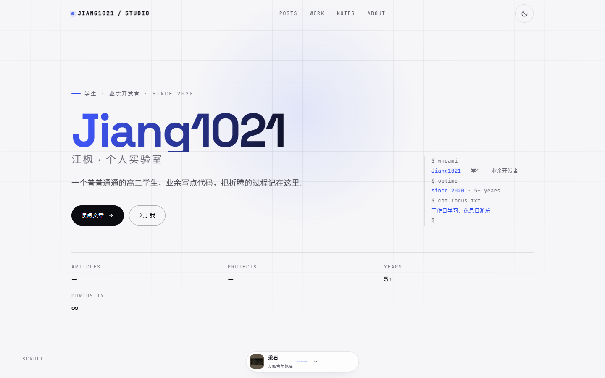
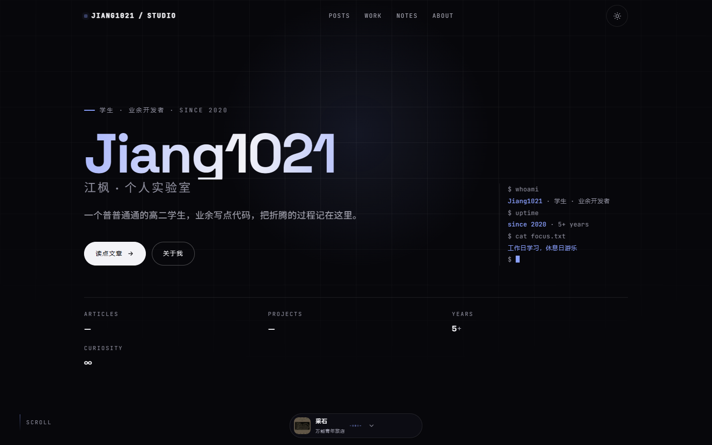
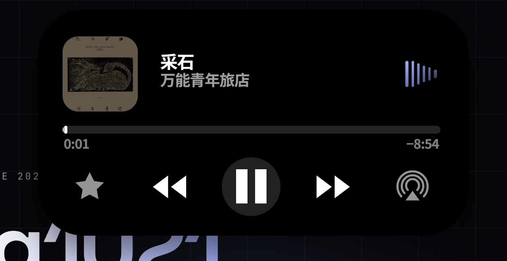
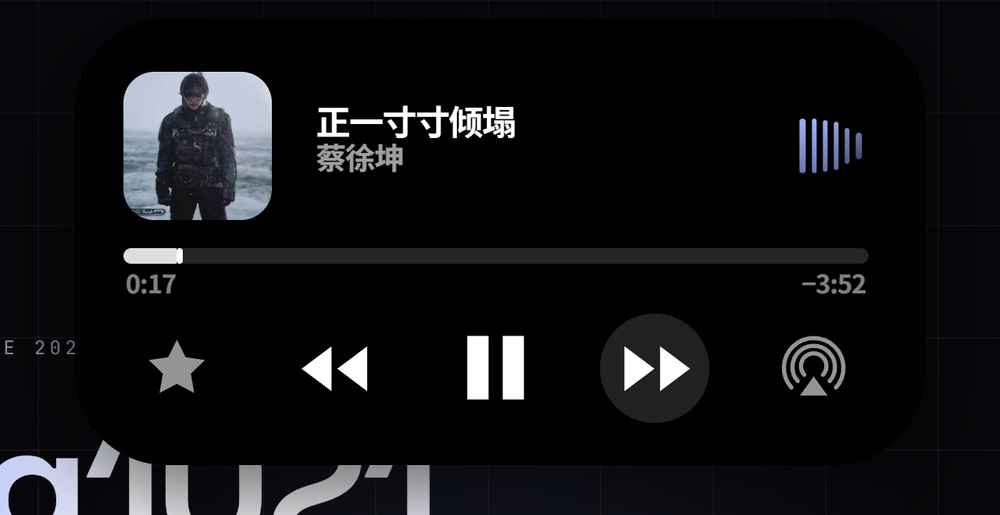

# 江枫的实验室 · Jiang1021's Lab

个人博客。**Astro 纯静态**，黑白双主题，线条是唯一的装饰。

> 当前状态：本地开发完成，部署目标为局域网服务器 `192.168.31.149`，公网暂不暴露。

## 预览




顶栏正中是**灵动岛音乐播放器**（折叠 / 展开 / 音量）：




## 特性

- **纯静态**：`output: 'static'`，`build.format: 'directory'`，产出可直接丢进任意静态服务器
- **双主题**：亮色 / 暗色，跟随系统并记忆用户选择（`localStorage['blog-theme']`），首屏内联脚本防闪烁
- **自托管字体**：`@fontsource/*`，不依赖任何外部 CDN
- **灵动岛播放器**：顶栏居中的可展开音乐播放器
  - 折叠 250×48 → 展开 544×286，全部尺寸用 `cqw` 容器查询驱动
  - 音频频谱可视化（Web Audio `AnalyserNode` + 自增益）
  - LRC 歌词跟唱，**没有歌词时显示曲名**
  - 播放列表：上一首 / 下一首 / 播完自动续播 / 循环
  - 音量菜单、静音、Esc 逐层关闭、键盘可达
  - **懒加载**：首屏不加载播放器脚本，鼠标碰岛或空闲时才拉取（`public/player.js` 单独一份，不进主包）
- **无障碍**：跳过链接、`aria-live` 状态播报、44×44 触摸目标、`prefers-reduced-motion` 降级

## 技术栈

| | |
|---|---|
| 框架 | Astro 7 |
| 样式 | 原生 CSS（无预处理器），CSS 变量 + 容器查询 |
| 脚本 | 原生 TypeScript / JavaScript，无前端框架 |
| 字体 | `@fontsource/space-grotesk`、`@fontsource/jetbrains-mono`、Noto Sans SC |
| 音频 | Opus（主）/ MP3（兼容），ffmpeg 转码自 FLAC |

## 目录

```
.
├── blog-astro/              # Astro 站点本体
│   ├── public/
│   │   ├── media/           # 音频、封面、LRC 歌词
│   │   └── player.js        # 灵动岛播放器（懒加载，独立于打包产物）
│   ├── shots/               # 截图
│   └── src/
│       ├── components/      # Nav / DynamicIsland / Footer ...
│       ├── data/site.ts     # 全站唯一内容源（文案、导航、播放列表）
│       ├── layouts/
│       ├── pages/
│       ├── scripts/         # 主题、岛加载器
│       └── styles/          # global.css + island.css
├── DESIGN.md                # 视觉规范
├── SERVER-NOTES.md          # 服务器 192.168.31.149 备忘
├── PROFILE-TODO.md          # 个人信息填写清单
└── BLOG-INSPIRATION-bad0rang3.md
```

## 本地运行

```bash
cd blog-astro
npm install
npm run dev        # http://localhost:4321
npm run build      # 产出到 blog-astro/dist/
npm run preview    # 预览构建结果
```

## 改内容

全站文案、导航、播放列表都在 **`blog-astro/src/data/site.ts`** 一个文件里，改它就行，不用动组件。

加歌：把音频（`.opus` + `.mp3`）、封面、`.lrc` 放进 `blog-astro/public/media/`，然后在 `tracks` 数组里加一条。

```bash
# FLAC → Opus / MP3
ffmpeg -i in.flac -map 0:a -c:a libopus -b:a 160k -vbr on -application audio out.opus
ffmpeg -i in.flac -map 0:a -c:a libmp3lame -b:a 192k out.mp3
# 封面 → WebP
ffmpeg -i cover.jpg -c:v libwebp -quality 88 cover.webp
```

## 测试

```bash
cd blog-astro
npm run test:lyrics     # LRC 解析模块单元测试（Node 内置 test runner，31 项，零第三方依赖）
```

## 致谢

顶栏**灵动岛播放器**的结构、样式与播放逻辑复刻自 [Bad0RANG3/Bad0RANG3.github.io](https://github.com/Bad0RANG3/Bad0RANG3.github.io)（已按本站配色重映射）。
其余页面结构、视觉规范与文案均为本站原创。

## 许可

代码部分可自由参考。**音乐与封面版权归各自权利人所有，仅作个人局域网自用，未获授权请勿再分发。**
